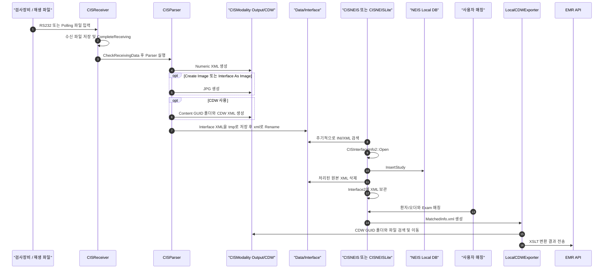
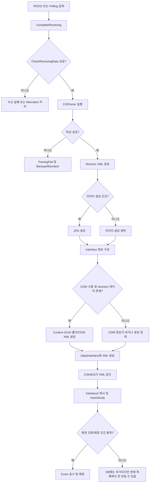

---
{"dg-publish":true,"dg-permalink":"260812-kbsmc-hwasung-localcdwexporter-numericvalue-issue","permalink":"/260812-kbsmc-hwasung-localcdwexporter-numericvalue-issue/","tags":["강북삼성화성","CISReceiver","CISNEIS","CISNEISLite","LocalCDWExporter","CDW","RS232","Numeric"],"dg-note-properties":{"created":"2026-08-12","tags":["강북삼성화성","CISReceiver","CISNEIS","CISNEISLite","LocalCDWExporter","CDW","RS232","Numeric"],"status":"분석"}}
---


# 260812-강북화성-LocalCDWExporter수치값 이슈

## 1. 문서 목적

강북삼성 화성건진 환경에서 발생한 혈압·청력 등의 수치값 누락 또는 다른 환자 수치값 전달 문제에 대해 다음 내용을 통합 정리한다.

- CISReceiver의 RS232/Polling 수신 및 Numeric 파싱
- CDW XML, Content GUID 폴더 및 Interface XML 생성
- CISReceiver → CISNEIS/CISNEISLite 전달
- CISNEIS의 로컬 Exam 추가와 매칭
- MatchedInfo.xml → LocalCDWExporter 처리
- `MoveCDWFiles failed` 발생 원인
- 파일 재처리, COM 테스트 및 Parser 설정 확인 사항

## 2. 핵심 결론

1. CISReceiver가 `Data\Interface`에 Interface XML을 생성하고 CISNEIS가 이를 가져가는 흐름은 정상 동작한다.
2. 2026-08-12 시험 로그에는 CISNEIS의 `InsertStudy`가 실행되었고 `Insert Study Failed`는 없다. Exam 추가 실패보다는 조회 날짜·환자 정보·매칭 조건 때문에 화면에서 보이지 않았을 가능성이 높다.
3. Numeric Parser의 `Create Image`는 CISNEIS Exam 추가의 필수 조건이 아니다. Numeric XML은 이미지 옵션보다 먼저 항상 생성된다.
4. `Interface As Image`를 선택하면 `InterfaceType=C` 및 JPG 경로가 전달되고, 해제하면 `InterfaceType=E` 및 Numeric XML 경로가 전달된다.
5. LocalCDWExporter의 `MoveCDWFiles failed: No matching MoveCDWDataFiles files found`는 MatchedInfo의 CDW GUID에 대응하는 GUID 폴더/파일을 찾지 못했다는 의미다. CISReceiver 파싱 성공과 LocalCDWExporter 이동 성공은 별개의 단계다.
6. 잘못된 RS232 데이터가 파서의 최소 형식 검사를 통과하면 Interface XML 자체는 만들어질 수 있다. 이때 환자 정보, 검사일, Numeric 항목 또는 CDW 속성이 비거나 잘못될 수 있다.
7. RS232와 Polling은 입력을 받는 방법만 다르고, `CompleteReceiving()` 이후 Parser·Interface·CDW 처리 루틴은 대부분 동일하다.

## 3. 전체 Workflow





## 4. 주요 디렉터리

| 경로 | 역할 |
|---|---|
| `CISModality\Receiving` | Receiver가 처리할 수신 원본 파일 |
| `CISModality\Polling` | File Polling Receiver가 감시하는 입력 위치 |
| `CISModality\Backup` | 처리한 원본 백업 |
| `CISModality\Output` | Numeric XML, JPG 등 Parser 결과 |
| `CISModality\CDW` | Content GUID 폴더와 CDW 전용 XML |
| `Data\Interface` | CISReceiver → CISNEIS 전달 Queue |
| `Data\Interface2` | CISNEIS가 소비한 신형 Interface XML 보관 위치 |

`CReceiverConfig::GetExternalOutputDir()`에서 NEIS/NEISTransfer의 실제 출력 위치는 `Data\Interface`로 결정된다. 설정 XML에 다른 Output 값이 보이더라도 현재 NEIS 분기에서는 이 경로가 사용된다.

## 5. CISReceiver Numeric 및 CDW 생성

### 5.1 Numeric XML과 Create Image

`CISNumericParser::OnCISParser_CreateOutput()`의 처리 순서는 다음과 같다.

1. `OnCISNumericParser_CreateXML()` 실행
2. XML 생성 실패 시 전체 출력 실패
3. `Create Image` 또는 `Interface As Image`가 켜져 있거나 PDF/DCM 생성에 JPEG가 필요할 때만 JPG 생성
4. 이후 Interface 정보 및 CDW 정보 구성

따라서 `Create Image`는 추가 JPG 생성 옵션이며, Numeric XML 또는 CISNEIS Exam 추가의 필수 조건이 아니다.

권장 설정:

- 수치 XML을 CISNEIS로 전달: `Create Image=OFF`, `Interface As Image=OFF`
- JPG도 별도로 보관: `Create Image=ON`, `Interface As Image=OFF`
- CISNEIS에 JPG를 Instance로 전달: `Interface As Image=ON`
- CDW 연계 필요: `CDW=ON`

### 5.2 InterfaceType 결정

| 설정 | InterfaceType | Instance | FilePath |
|---|---|---|---|
| `Interface As Image=OFF` | `E` | `N` | Numeric XML |
| `Interface As Image=ON` | `C` | `J` | JPG |

`Create Image`만 켜는 것은 InterfaceType을 `C`로 바꾸지 않는다. `C`로 생성됐다면 저장된 내부 설정의 `InterfaceAsImage` 값을 확인해야 한다.

### 5.3 CDW GUID 구조

정상적인 Interface XML의 CDW 영역 예시:

```xml
<CDW>
  <Content guid="CONTENT-GUID" type="NUM"/>
  <Numeric guid="NUMERIC-DESIGN-GUID"
           file="...\CISModality\CDW\CONTENT-GUID\CONTENT-GUID_CDW.xml"/>
</CDW>
```

| 값 | 의미 |
|---|---|
| `Content@guid` | 측정 건을 식별하고 CDW 폴더와 연결하는 GUID |
| `Content@type` | 보통 Numeric은 `NUM` |
| `Numeric@guid` | Numeric/CDW 디자인 GUID |
| `Numeric@file` | LocalCDWExporter가 사용할 CDW Numeric XML의 실제 경로 |

Content GUID가 생성되면 일반적으로 같은 GUID의 폴더와 관련 XML이 만들어진다. 그러나 CDW 옵션이 꺼져 있거나, Numeric 항목이 없거나, `CloningEx`/저장 단계가 실패하면 Interface XML만 생성되고 CDW 폴더 또는 CDW 속성이 없을 수 있다.

## 6. CISNEIS Interface 처리

`CNEISDlg::TEvent_ReceiverEvent()` 처리:

1. 실행 루트의 `Data\Interface` 확인
2. `*.ini`를 먼저 검색하고 없으면 `*.xml` 검색
3. XML은 `CISInterfaceInfo2::Open()`으로 파싱
4. 날짜와 ExamCode/EquipCode 보정
5. `Data\Interface2`로 복사
6. `NEISMDBHelper::InsertStudy(InfoNew, 복사경로)` 실행
7. `Exam_FromReceiver()`로 화면 목록 갱신
8. 원본 `Data\Interface` XML 삭제

주의사항:

- `Data\Interface`에 INI가 계속 남아 있으면 XML 처리가 지연될 수 있다.
- XML Open 또는 DB 등록 실패 시에도 원본을 삭제하는 경로가 있으므로 실패 파일 보존 정책을 검토할 필요가 있다.
- CISNEISLite도 `Data\Interface`를 감시하지만 로컬 저장과 매칭 구현은 CISNEIS와 다르다.

## 7. 2026-08-12 로그 판정

### 7.1 09:23:01

CISReceiver:

- `CheckReceivingData result[1]`
- `Create XML ... Succeed`
- `bInterfaceCDW(TRUE)`
- `Write the interface information: ...\Data\Interface\20260812092301_...xml`
- `success[1] error[0]`

CISNEIS:

- `NEISMDBHelper :: InsertStudy`
- `m_MDB.BeginTrans`
- `SHOW_NEIS #1`, `SHOW_NEIS #2`
- `Insert Study Failed` 없음

따라서 Receiver 생성과 NEIS DB 추가는 정상으로 판단한다.

### 7.2 화면에서 Exam이 안 보인 이유

실제 Interface2 XML:

```xml
<ID/>
<Name/>
<AccNo/>
<ExamStart>20260807101500</ExamStart>
<Acqusition>20260812092301</Acqusition>
<ExamCode>UA2001</ExamCode>
<EquipCode>testecg</EquipCode>
<InterfaceType>E</InterfaceType>
```

가능성이 높은 원인:

1. 파일 수신일은 8월 12일이지만 `ExamStart`는 8월 7일이라 8월 12일 조회 목록에서 보이지 않음
2. ID, Name, AccNo가 비어 있어 환자 또는 Worklist 검색/매칭 불가
3. 로그상 `Search by ExamCode=0`, `Auto Merge=0`이어서 자동 병합되지 않음
4. 미매칭 로컬 Exam으로 추가됐지만 화면 필터 조건에 걸림

우선 CISNEIS 검사일을 `2026-08-07`로 설정하고 환자 ID가 없는 미매칭 Exam을 조회해야 한다.

### 7.3 09:33:40 설정 변화

09:23/09:27 파일은 `InterfaceType=E`, XML 경로였으나 09:33 파일은 `InterfaceType=C`, JPG 경로였다. 이는 해당 시점에 실제 적용된 `InterfaceAsImage`가 활성화됐음을 의미한다.

확인 항목:

- Parser Setting에서 `OK`를 눌러 저장했는지
- 편집한 Receiver가 실제 실행 중인 TM-2657 설정인지
- CISReceiver 재시작 뒤 설정이 유지되는지
- 설정 XML의 `InterfaceAsImage` 값이 1인지

## 8. LocalCDWExporter Move 실패 분석

로그 문구:

```text
MoveNumCdwFiles failed: No matching MoveCDWDataFiles files found
```

의미:

- LocalCDWExporter가 처리할 MatchedInfo 또는 최신 CDW 작업을 읽었지만 대응하는 CDW GUID 폴더/파일을 찾지 못함
- CISReceiver에서 Interface XML을 성공적으로 저장했다는 사실만으로 CDW 이동 성공이 보장되지는 않음

확인 순서:

1. MatchedInfo.xml의 CDW GUID 확인
2. Interface XML의 `CDW/Content@guid`와 같은지 비교
3. `CISModality\CDW\<ContentGUID>` 폴더 존재 확인
4. `<ContentGUID>_CDW.xml` 존재 확인
5. `Numeric@file`의 경로가 실제 파일과 일치하는지 확인
6. LocalCDWExporter가 선택한 최신 EXAMDATA/CDW 폴더가 해당 GUID인지 확인
7. 다른 환자의 오래된 최신 폴더를 선택하는 로직이 있는지 확인

핵심 개선 방향은 “가장 최신 XML”이 아니라 MatchedInfo에 포함된 `CDWGUID`로 대상 폴더와 파일을 직접 찾는 것이다.

## 9. 잘못된 RS232 데이터의 영향

잘못된 원본 데이터에 대한 결과는 두 가지다.

### 파싱 이전에 차단되는 경우

- 프레임 길이, 시작/종료 문자, 필수 레코드 등 `CheckReceivingData()` 조건 실패
- Parser가 실행되지 않거나 ParsingFail/Mismatch 처리
- Interface XML과 CDW 파일이 만들어지지 않음

### 파서를 통과하지만 내용이 잘못된 경우

- 환자 ID/이름/검사일이 비거나 잘못됨
- MAX/MIN 등의 Numeric 값 누락 또는 오인식
- Numeric 항목이 없어서 CDW 폴더/파일 생성을 건너뜀
- Interface XML은 생성되지만 CDW 속성이 비거나 잘못된 GUID/경로가 들어감

따라서 “Interface XML 존재”는 통신과 일부 파싱이 성공했다는 의미일 뿐, Numeric 및 CDW 데이터가 유효하다는 보장은 아니다.

## 10. RS232 없이 파일로 재현하는 방법

### 권장: File Polling Receiver

1. CISReceiver에서 동일 장비 타입(TM-2657 등)의 File Polling Receiver 생성
2. 원본 백업 `.org`/`.dat` 형식에 맞춰 File Extension 설정
3. Polling 감시 폴더 지정
4. 실제 운영 Receiver와 동일한 ExamCode, EquipCode, Parser Setting 적용
5. 원본 백업 파일을 Polling 폴더에 복사
6. 다음 로그를 순서대로 확인
   - `Copy Success`
   - `CompleteReceiving`
   - `CheckReceivingData result[1]`
   - `Create XML ... Succeed`
   - CDW 관련 로그
   - `Write the interface information`
   - CISNEIS `InsertStudy`

운영 `Receiving` 폴더에 파일을 직접 넣는 것만으로는 새 수신 이벤트가 발생하지 않을 수 있다. 감시·완료 이벤트를 발생시키는 Polling 방식을 권장한다.

### 코드 수정 방식

파일 경로를 받아 기존 `CompleteReceiving(lpszOutFile)` 또는 그 직전의 정상 수신 완료 진입점으로 전달하는 테스트 기능을 추가한다. Parser를 직접 호출하는 방식은 Receiver의 파일명 생성, 백업, Mismatch 및 설정 주입 단계를 건너뛸 수 있으므로 재현 정확도가 떨어진다.

## 11. COM 전송 및 가상 포트 테스트

### 연결 구조

```text
RS232Tester(COM3) ── null modem / virtual pair ── CISReceiver(COM4)
```

`COM3`와 `COM4`는 서로 연결된 가상 포트 쌍이다. 한쪽으로 쓴 데이터가 다른 쪽에서 수신된다. 동일 COM 포트를 두 프로그램이 동시에 여는 구조가 아니다.

### com0com 사용 개요

1. 관리자 권한으로 com0com 설치
2. Setup Command Prompt에서 포트 쌍 생성
3. 각 끝의 PortName을 예: COM3, COM4로 설정
4. RS232Tester는 COM3, CISReceiver는 COM4 사용
5. Baud rate, Data bits, Parity, Stop bits, Flow control을 장비 사양과 동일하게 설정
6. 원본 파일은 바이너리 그대로 전송하고 필요 시 STX/ETX/CR/LF 포함 여부 확인

제거할 때는 com0com Setup에서 해당 pair 번호를 확인한 뒤 그 pair만 삭제한다. 실제 물리 COM 포트나 다른 가상 pair를 삭제하지 않도록 이름을 먼저 확인한다.

### 사용할 수 있는 송신 도구

- 장비 전용 RS232Tester
- RealTerm
- Hercules SETUP utility
- Tera Term/일반 Serial Terminal
- 사내 테스트 유틸

텍스트 모드로 열어 저장하면 제어문자나 바이너리가 변형될 수 있으므로 원본 백업 파일은 Binary/File Send 기능으로 전송하는 것이 안전하다.

## 12. RS232와 Polling 처리 루틴 비교

| 단계 | RS232 | Polling |
|---|---|---|
| 입력 획득 | COM 바이트 수신 | 감시 폴더 파일 발견/복사 |
| 수신 완료 판단 | 종료문자, 길이, Timeout 등 | 파일 완료 대기시간, 파일 잠금/변경시간 |
| 이후 처리 | `CompleteReceiving()` → Parser | `CompleteReceiving()` → Parser |
| Numeric/Interface/CDW | 동일 Parser 설정 사용 | 동일 Parser 설정 사용 |

즉 입력 획득과 완료 판단은 다르지만 정상적으로 수신 파일이 확정된 뒤에는 동일 계열 루틴을 탄다. 다만 Receiver별 설정과 파일 확장자, 장비 모듈, Parser Setting이 동일해야 결과를 정확히 비교할 수 있다.

## 13. 코드 위치

| 기능 | 파일/함수 |
|---|---|
| NEIS 출력 경로 결정 | `D:\Proj\CIS_1400\trunk\Source\CISReceiver\ReceiverConfig.cpp` / `GetExternalOutputDir()` |
| Receiver 수신 완료 및 Parser 시작 | CISReceiver의 `CompleteReceiving()` 관련 코드 |
| 전체 Parser 및 CDW 처리 | `D:\Proj\CIS_LIB_2008\CISLib\trunk\Source\CISModality\CISParser.cpp` / `CISParser::Parsing()` |
| Numeric XML/JPG 생성 | `...\CISNumericParser.cpp` / `OnCISParser_CreateOutput()` |
| InterfaceType 및 Instance 결정 | `...\CISNumericParser.cpp` / `OnCISParser_ThirdPartyInfo2()` |
| Interface XML 저장 | `CISInterfaceInfo2::Save()` 및 `WriteThirdPartyInformation()` |
| CDW GUID 폴더/XML 생성 | `CISInterfaceInfo2::CloningEx()` 관련 처리 |
| CISNEIS Queue 감시 | `D:\Proj\CIS_1400\trunk\Source\CISNEIS\NEISDlg.cpp` / `TEvent_ReceiverEvent()` |
| CISNEIS Local DB 등록 | `D:\Proj\CIS_1400\trunk\Source\CISNEIS\NEISMDBHelper.cpp` / `InsertStudy()` |
| CISNEISLite Queue 처리 | CISNEISLite의 `OnReceiverRoutine()` 관련 코드 |

## 14. 권장 재현 및 점검 체크리스트

- [ ] 운영 원본 `.org`/`.dat` 파일을 별도 복사해 보존
- [ ] File Polling Receiver로 같은 파일을 재생
- [ ] `CheckReceivingData result[1]` 확인
- [ ] Output Numeric XML의 MAX/MIN 등 수치 확인
- [ ] Interface XML의 ID, Name, ExamStart, ExamCode 확인
- [ ] `InterfaceType`과 FilePath 확장자 확인
- [ ] `CDW/Content@guid`, `Numeric@guid`, `Numeric@file` 확인
- [ ] GUID 폴더 및 `<GUID>_CDW.xml` 실재 확인
- [ ] CISNEIS `InsertStudy` 및 `Insert Study Failed` 확인
- [ ] CISNEIS 조회일을 XML의 ExamStart 날짜로 설정
- [ ] 환자 ID가 빈 미매칭 Exam 확인
- [ ] MatchedInfo의 GUID와 Receiver GUID 비교
- [ ] LocalCDWExporter가 같은 GUID를 선택하는지 확인
- [ ] 성공/실패 파일을 각각 보관해 필드 단위 비교

## 15. 개선 권고

1. Receiver 로그에 Content GUID, Numeric GUID, Numeric file 및 폴더 생성 결과를 한 줄로 함께 기록한다.
2. CDW Numeric 항목이 0개면 Interface XML에 빈 CDW를 남기기보다 명확한 경고와 사유 코드를 기록한다.
3. CISNEIS의 Interface XML Open/Insert 실패 파일은 삭제 대신 실패 보관 폴더로 이동한다.
4. LocalCDWExporter는 최신 폴더 추정 대신 MatchedInfo의 CDW GUID를 기준으로 정확히 선택한다.
5. `MoveCDWFiles failed` 로그에 기대 GUID, 검색 루트, 후보 파일 수, 실제 검색 패턴을 추가한다.
6. 재현 시험에서는 수신일과 원본의 ExamStart가 다를 수 있음을 화면과 로그에 명시한다.

## 16. 관련 자료

- Receiver 로그: `D:\Proj\CIS_1400\trunk\BIN\Win32\ReleaseUnicode\Log\Receiver\CIS Receiver_20260812.log`
- NEIS 로그: `D:\Proj\CIS_1400\trunk\BIN\Win32\ReleaseUnicode\Log\NEIS\CIS NEIS_20260812.log`
- 2026-08-07 분석 로그: `D:\doc\이슈\260811-강북삼성CDWGUID누락\수치값 누락관련 로그파일_20260807`
- 관련 Obsidian 노트: [[CISReceiver-CISNEIS_Interface_XML_전달_처리_흐름\|CISReceiver-CISNEIS_Interface_XML_전달_처리_흐름]]
- 관련 Obsidian 노트: [[강북삼성-LocalCDWExporter 수치값 누락 및 잘못되는 현상 건\|강북삼성-LocalCDWExporter 수치값 누락 및 잘못되는 현상 건]]
- 관련 Obsidian 노트: [[260812-강북삼성화성건진-혈압,청력수치값 이슈\|260812-강북삼성화성건진-혈압,청력수치값 이슈]]

