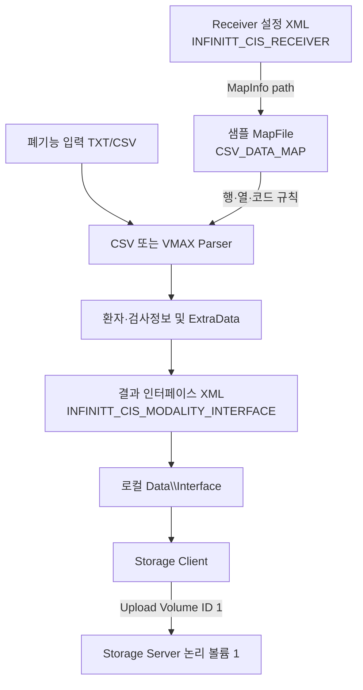

---
{"dg-publish":true,"permalink":"/260813-custom-receiver-review/","dg-note-properties":{"permalink":"/260813-custom-receiver-review/"}}
---


#고대구로 #CustomReceiver #폐기능 #CSV #StorageClient #MapFile #기능검토

# 260813-고대구로-폐기능-CustomReceiver 검토

## 관련 노트
- 현장 확인 및 최초 테스트 기록: [[260813-고대구로-폐기능-CustomReceiver기능확인\|260813-고대구로-폐기능-CustomReceiver기능확인]]

## 문서 목적
2026-08-13 고대구로병원 폐기능 검사실에서 확인한 `CISCustomReceiver` 설정과 실행 결과를 소스, 로그, Receiver 설정 XML 및 결과 인터페이스 XML과 대조하여 정리한다.

## 문의사항 정리
1. `Create Image`가 체크되어 있는데 JPG가 생성되지 않은 것이 정상인지
2. Storage Client의 Volume ID에 XML이 생성된 것이 정상인지
3. Extract Data의 MapFile이 Add Receiver로 생성된 Receiver XML을 가리키는 것이 정상인지
4. 정상 샘플 MapFile로 변경하면 Receiver XML과 Volume ID 결과 XML이 어떻게 동작하는지
5. 현재 Receiver가 어떤 Vendor 및 Modality로 등록된 것인지

## 확인 자료
### 실행 및 설정
- 배포 경로: `C:\INFINITT\CISCustomReceiverU`
- 애플리케이션 버전: `CISCustomReceiverU.exe 2.0.1.1`
- CSV 모달리티 DLL: `CSVModalityU.dll 2.0.1.1`
- 입력 폴더: `C:\NETLINK`
- 입력 필터: `*.txt`
- Receiver Name: `KUMC-VMAX`
- Storage Server: `10.0.3.241:4003`
- Upload Volume ID: `1`

### 주요 첨부 파일
- 로그: `C:\INFINITT\CISCustomReceiverU\Log\CISCustomReceiver_20260813.log`
- 결과 인터페이스 XML: `20260813101156_05E4BA20_7z6epn95_0000000a_0001.xml`
- Receiver 설정 XML: `Receiver\20220810153326_03C19C20_vvtx77fb_00000009.xml`
- 정상 Map 예제: `D:\Proj\CIS_ETC\CISCustomReceiver\doc\고려대병원\VMAX\CISReceiver_vmax_map.xml`

## 최종 결론
1. 현재 설정은 **Vendor `CSV` / Modality `CSV(NumericOnly)` / Receiver Type `Polling`**이다.
2. `KUMC-VMAX`는 Receiver 이름과 Interface Code이며 실제 Modality가 VYNTUS라는 의미는 아니다.
3. 수치 전용 Parser는 실제 Image를 생성하지 않으면서 성공을 반환하므로 `Create JPG ... Succeed` 로그는 실제 JPG 생성을 의미하지 않는다.
4. Storage Client가 결과 인터페이스 XML을 지정 Volume ID로 업로드하는 것은 정상 구조다.
5. 현재 MapFile이 Receiver 설정 XML 자신을 가리키는 것은 잘못된 설정이다.
6. MapFile과 Volume ID 결과 XML은 서로 다른 파일이며 관계는 `설정 규칙 → 파싱 → 결과 생성 → Volume 업로드`의 단방향 관계다.
7. 폐기능 수치 177개는 생성됐지만 검사일 및 환자 기본정보가 불완전하여 최종 연동 전 데이터 품질 검증이 필요하다.

## Vendor 및 Modality 판정
Receiver 설정 XML에는 다음 값이 저장되어 있다.

```xml
<Vendor id="1000"/>
<Modality id="1"/>
<Type id="8"/>
```

| XML 값 | 내부 정의 | Add Receiver 화면 |
|---|---|---|
| `Vendor id="1000"` | `cis_modality_vendor_CSV` | Vendor `CSV` |
| `Modality id="1"` | `CSV_modality_NumericOnly` | Modality `CSV` |
| `Type id="8"` | `cis_interface_type_Polling` | Type `Polling` |

CSV 모달리티 내부 ID는 다음과 같다.

| ID | Modality |
|---:|---|
| 0 | CSV&Image |
| 1 | CSV, NumericOnly |
| 2 | Text |
| 3 | VYNTUS |

따라서 현재 설정을 `CSV/VYNTUS 계열`이라고 넓게 표현할 수는 있지만, **실제 선택된 Modality는 VYNTUS가 아니라 CSV NumericOnly**이다.


## Image가 생성되지 않은 원인
Receiver XML에는 다음처럼 Image 생성이 활성화되어 있다.

```xml
<CreateJPEG>1</CreateJPEG>
```

하지만 `CSVNumericParser`와 `VYNTUSParser`의 Image 생성 함수는 실제 파일을 만들지 않고 바로 `TRUE`를 반환한다.

```cpp
BOOL CSVNumericParser::OnCISImageParser_CreateImage(BOOL bCreateImage, BOOL bNeedJPEG)
{
    return TRUE;
}
```

이 때문에 다음 현상이 동시에 발생한다.

1. 로그에는 `Create JPG ... Succeed` 기록
2. 실제 Output 폴더에는 JPG 없음
3. 파싱 결과는 `Success: 1`로 집계
4. 결과 XML의 Instance는 `type="J"`로 기록
5. Instance의 `FilePath`는 생성 JPG가 아니라 원본 `.txt` 경로

따라서 Image가 필요한 요구사항이라면 현재 `CSV NumericOnly + *.txt` 구성으로는 충족되지 않는다. 실제 이미지 파일과 함께 `CSV&Image` Modality를 사용하거나 TXT 수치를 이미지로 렌더링하는 별도 개발이 필요하다.

## 결과 인터페이스 XML 분석
첨부 결과 XML의 루트는 다음과 같다.

```xml
<INFINITT_CIS_MODALITY_INTERFACE>
```

확인 결과:

- Patient ID: `1234678`
- ExtraData: 177개
- Instance Type: `J`
- FilePath: `...\Receiving\....txt`
- ExamStart: `18991230000000`
- ExamEnd: `18991230000000`
- Name/Gender/AccNo: 비어 있음

폐기능 수치 추출은 수행됐지만 다음 항목은 비정상 또는 불완전하다.

- `type="J"`인데 실제 파일은 TXT
- 검사일이 OLE 기본일자에 해당하는 `1899-12-30`
- 환자 이름, 성별, Accession Number 누락

## 세 종류 XML의 역할
### 1. Receiver 설정 XML
- 루트: `INFINITT_CIS_RECEIVER`
- 위치: `Receiver\*.xml`
- Add Receiver 또는 Change 시 저장
- Vendor, Modality, Polling, Parser 옵션 및 MapFile 경로 포함
- 애플리케이션 시작 시 Receiver 구성을 위해 로드

### 2. MapFile
- 루트: `CSV_DATA_MAP`
- 일반적인 위치: `Config\Receiver\*.xml`
- 입력 TXT/CSV에서 환자 정보, 검사일, 수치 Label/Value/Unit을 찾는 규칙
- Receiver 설정 XML의 `<MapInfo path="..."/>`에서 경로만 참조

### 3. 결과 인터페이스 XML
- 루트: `INFINITT_CIS_MODALITY_INTERFACE`
- 검사 입력 한 건마다 생성
- 환자정보, 검사정보, 파일 경로 및 `ExtraData` 포함
- 전역 Interface 설정이 Storage Client이면 지정 Volume ID로 업로드

## 현재 MapFile 설정 문제
현재 Receiver XML은 다음과 같이 자기 자신을 MapFile로 가리킨다.

```xml
<MapInfo path="C:\INFINITT\CISCustomReceiverU\Receiver\20220810153326_03C19C20_vvtx77fb_00000009.xml"/>
```

이 파일의 루트는 `INFINITT_CIS_RECEIVER`이므로 MapFile이 요구하는 `CSV_DATA_MAP` 구조와 맞지 않는다.

정상 예시는 다음과 같이 별도 MapFile을 참조해야 한다.

```xml
<MapInfo path="C:\INFINITT\CISCustomReceiverU\Config\Receiver\CISReceiver_vmax_map.xml"/>
```

### 주의사항
현재 잘못된 경로 상태에서 Extract Data의 `Setting`을 열어 `OK`로 저장하면 `CSVMap::Save()`가 해당 경로에 Map XML을 기록한다. 이 경우 Receiver 설정 XML이 `CSV_DATA_MAP` 형식으로 덮어써져 Receiver가 재시작 후 로드되지 않을 위험이 있다.

## 정상 샘플 MapFile 적용 시 동작
일반 CSV Parser에서는 MapFile이 다음 결과를 결정한다.

- `Information/Data`: Patient ID, 이름, 검사일 등의 행과 열
- `NumericData/Search`: 수치 Label, Value, Unit 열 및 결과 코드
- 파싱 결과: 인터페이스 XML의 `<ID>`, `<ExamStart>`, `<ExtraData>`

그러나 VMAX/VYNTUS 전용 Parser 경로는 소스상 MapFile을 열지 않고 `ParsingVyaireData()`를 직접 호출하는 구현도 존재한다. 이 경로에서는 정상 MapFile로 변경해도 현재 폐기능 `ExtraData` 결과가 달라지지 않을 수 있다. 그래도 잘못된 자기 참조 제거와 설정 파일 보호를 위해 MapFile 경로는 정상화해야 한다.



## MapFile과 Volume ID의 관계
- MapFile은 파싱 규칙 파일이며 Storage Volume으로 업로드되지 않는다.
- Receiver 설정 XML도 Storage Volume으로 업로드되지 않는다.
- MapFile 내용이 결과 XML에 그대로 복사되는 것이 아니다.
- Map 규칙으로 추출된 값만 결과 XML의 필드와 `ExtraData`에 반영된다.
- Volume ID는 결과 인터페이스 XML을 저장할 Storage Server의 논리 볼륨 번호다.

관계를 한 줄로 정리하면 다음과 같다.

> Receiver 설정이 MapFile을 참조하고, Parser가 입력 파일과 Map 규칙으로 결과 XML을 만든 후, Storage Client가 그 결과 XML만 지정 Volume ID로 업로드한다.

## Storage Client 로그 분석
Storage Client가 정상 동작한 실행에서는 다음 로그 흐름이 확인된다.

1. `Write the interface information`
2. `Connection has succeeded [10.0.3.241]`
3. `Sending "...xml" has been started`
4. `SEND 100%`
5. `Sending "...xml" has been completed`

`10:05:21`, `10:10:35` 실행에서는 위 흐름이 확인됐다.

첨부 결과 XML과 같은 파일명이 생성된 `10:11:56` 실행에서는 `Write the interface information` 이후 Storage Client 연결 및 전송 로그가 없다. 따라서 이 특정 실행 파일이 Storage Client를 통해 Volume 1로 업로드됐다고 로그만으로 확정할 수 없다. 설정 저장 또는 적용 시점이 달랐을 가능성을 함께 확인해야 한다.

## CreateXML과 Interface XML 차이
Parser 화면의 `CreateXML`과 메인 Settings의 `Interface → New(.xml)`은 서로 다른 옵션이다.

- Parser `CreateXML`: Parser 자체 출력 XML 옵션
- 전역 `Interface`: 외부 연동용 인터페이스 파일 생성 여부

따라서 Parser의 `CreateXML=0`이어도 전역 Interface가 켜져 있으면 `INFINITT_CIS_MODALITY_INTERFACE` XML은 생성될 수 있다.

## 권장 조치
### 수치 XML 연동만 필요한 경우
1. `Create Image` 해제
2. MapFile을 별도의 정상 `CSV_DATA_MAP` 파일로 변경
3. Receiver XML 자기 참조 제거
4. Patient ID, 검사일 및 177개 수치 코드 검증
5. Storage Client 전송 완료 로그 확인
6. 결과 XML의 `FilePath`와 `Instance type`에 대한 수신 시스템 허용 여부 확인

### 실제 JPG가 필요한 경우
1. `CSV&Image` Modality 적용 가능성 검토
2. `jpg/png/bmp/tif` 실제 이미지와 연결 CSV를 함께 수신
3. 또는 VMAX TXT 수치를 JPG/PDF로 렌더링하는 기능 개발
4. 결과 XML의 `FilePath`가 실제 존재하는 JPG를 가리키는지 확인

## 재시험 체크리스트
- [ ] Receiver: Vendor `CSV`, 목적에 맞는 Modality 선택
- [ ] Input Filter 및 실제 입력 확장자 일치
- [ ] MapFile 루트가 `CSV_DATA_MAP`인지 확인
- [ ] MapFile이 Receiver XML을 가리키지 않는지 확인
- [ ] `Create Image` 요구사항 유무 확인
- [ ] 실제 JPG 파일 존재 확인
- [ ] 결과 XML의 `Instance type`과 확장자 일치 확인
- [ ] Patient ID 및 검사일 정상 확인
- [ ] 필수 폐기능 수치 코드와 값 확인
- [ ] Storage Client `Sending ... completed` 확인
- [ ] Volume ID 1의 실제 Storage 경로에서 결과 XML 확인

## 소스 근거
- `D:\Proj\CIS_ETC\CISCustomReceiver\trunk\Include\CSVModalityLib.h`
  - CSV Vendor 및 Modality ID 정의
- `D:\Proj\CIS_ETC\CISCustomReceiver\trunk\Source\CSVModality\CSVNumericParser.cpp`
  - NumericOnly Image 생성 함수의 빈 구현
- `D:\Proj\CIS_ETC\CISCustomReceiver\trunk\Source\CSVModality\VYNTUSParser.cpp`
  - VYNTUS 파싱 및 Image 생성 함수
- `D:\Proj\CIS_ETC\CISCustomReceiver\trunk\Source\CSVModality\CSVParserSetting.cpp`
  - 기본 MapFile 경로 생성 및 Receiver XML 내 MapInfo 저장
- `D:\Proj\CIS_ETC\CISCustomReceiver\trunk\Source\CSVModality\CSVMap.cpp`
  - `CSV_DATA_MAP` 로드 및 저장
- `D:\Proj\CIS_ETC\CISCustomReceiver\trunk\Source\CISCustomReceiver\CISCustomReceiverDlg.cpp`
  - Storage Client 업로드 및 Volume ID 전달

## 관련 문서
- [[260813-고대구로-폐기능-CustomReceiver기능확인\|260813-고대구로-폐기능-CustomReceiver기능확인]]
