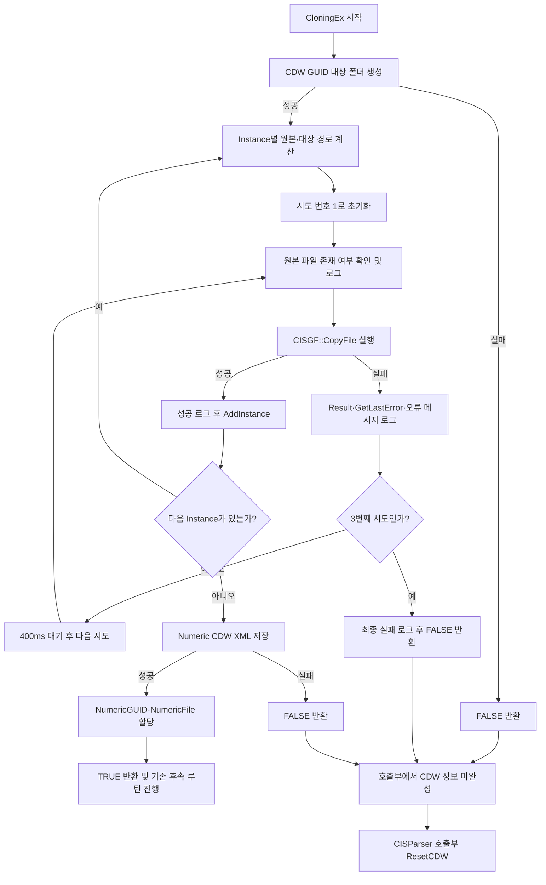

---
{"dg-publish":true,"dg-permalink":"260820-kbsmc-hwasung-cisreceiver-cdw-copy-retry","permalink":"/260820-kbsmc-hwasung-cisreceiver-cdw-copy-retry/","tags":["CISReceiver","CISModality","CDW","CloningEx","CopyFile","강북삼성화성건진"],"dg-note-properties":{"created":"2026-08-20","updated":"2026-08-20","tags":["CISReceiver","CISModality","CDW","CloningEx","CopyFile","강북삼성화성건진"],"status":"코드 재검토"}}
---


# 260820-강북삼성화성건진수치값이상관련CISReceiver변경내용정리

## 관련 상위 노트

- [[260812-강북삼성화성건진-혈압,청력수치값 이슈\|260812-강북삼성화성건진-혈압,청력수치값 이슈]]
- [[260812-강북화성-LocalCDWExporter수치값 이슈\|260812-강북화성-LocalCDWExporter수치값 이슈]]
- [[강북삼성-LocalCDWExporter 수치값 누락 및 잘못되는 현상 건\|강북삼성-LocalCDWExporter 수치값 누락 및 잘못되는 현상 건]]

## 결론

강북삼성 화성건진 혈압 검사에서 확인된 `MatchedInfo_*.xml`의 `CDWGUID` 누락은, CISReceiver가 수치 원본 XML을 CDW GUID 폴더로 복사하는 `CISInterfaceInfo2::CloningEx()` 단계에서 실패한 흐름과 연결된다.

2026-08-19 오류 `MatchedInfo_*.xml` 5건은 모두 생성 직전 CISReceiver 로그에서 `CopyFile Failed`가 확인되었다. 실패 시점은 각각 약 4초, 9초, 18초, 10초, 8초 전이다. 따라서 단순한 LocalCDWExporter 검색 실패보다 앞단의 CISReceiver CDW 산출물 생성 실패가 직접 원인으로 판단된다.

> [!important]
> 이 사례는 혈압 장비 `A&D Company / TM-2657` 흐름이다. 청력 검사 산출물 문제와 같은 현상으로 단정하지 않는다.

## 장애 연결 흐름

1. CISReceiver가 장비 데이터를 파싱하고 Numeric 항목을 생성한다.
2. `CloningEx()`가 CDW GUID 폴더를 만든다.
3. Output의 수치 XML을 `{CDWOutput}\{ContentGUID}\{ContentGUID}_0000.xml`로 복사한다.
4. 복사가 실패하면 CDW Numeric XML 저장과 GUID 할당 단계까지 진행하지 못한다.
5. 호출부가 `m_ThirdPartyINFO2.ResetCDW()`를 수행한다.
6. CISNEIS가 CDW 정보가 비어 있는 Interface XML을 받아 `CDWGUID` 없는 `MatchedInfo_*.xml`을 생성한다.
7. LocalCDWExporter는 조회할 GUID/경로가 없어 오류 처리한다.

## 현재 코드 재검토 결과

검토 기준 파일: `D:\Proj\CIS_LIB_2008\CISLib\trunk\Source\CISModality\CISInterfaceInfo2.cpp`

### 적용된 변경

- `GetWin32ErrorMessage(DWORD)`가 추가되어 Win32 오류 코드를 시스템 메시지로 변환한다. (`853~890`행)
- `CloningEx()`는 각 Instance 복사를 **최대 3회** 시도한다. (`940~947`행)
- 각 시도 전 `GetFileAttributes()`로 원본 존재 여부를 확인하고 다음을 기록한다.
  - 시도 번호
  - `SourceExists`
  - `SourceCheckGLE`
  - 원본·대상 경로
- `CISGF::CopyFile()` 실패 시 다음을 기록한다.
  - 라이브러리 반환값 `Result`
  - `GetLastError`
  - 시스템 오류 문자열 `ErrorMessage`
  - `SourceExists`
  - 원본·대상 경로와 Instance 인덱스
- 재시도 중 한 번이라도 성공하면 기존 정상 루틴인 `AddInstance()` → `ndCDW.SaveAs()` → Numeric GUID/File 할당을 계속한다.
- 3회 모두 실패하면 최종 실패 로그 후 `FALSE`를 반환하며, 호출부 `CISParser.cpp`의 `ResetCDW()` 흐름으로 이어진다.

### 요구사항과 현재 코드의 차이

초기 요구는 실패 후 **500ms 대기**였으나, 현재 구현값은 아래와 같이 **400ms**이다.

```cpp
const int   COPY_MAX_ATTEMPTS = 3;
const DWORD COPY_RETRY_DELAY  = 400;
```

3회 시도 사이에만 대기하므로 한 Instance당 최대 대기 횟수는 2회이며, 추가 대기시간은 최대 약 800ms이다. 운영 요구가 정확히 500ms이면 `COPY_RETRY_DELAY`를 `500`으로 맞춰야 한다.

## 변경 후 순서도



## 성공·실패 분기 요약

| 조건 | `CloningEx()` 결과 | 후속 처리 |
|---|---:|---|
| 1~3회 중 복사 성공 | `TRUE` 진행 가능 | Instance 등록, CDW XML 저장, Numeric GUID/File 할당 |
| 3회 모두 복사 실패 | `FALSE` | 호출부에서 CDW 정보 초기화, Interface XML의 CDW 값 누락 가능 |
| 대상 폴더 생성 실패 | `FALSE` | CDW 산출물 생성 중단 |
| `ndCDW.SaveAs()` 실패 | `FALSE` | Numeric GUID/File 할당 전에 중단 |

## 로그 확인 기준

정상적인 재시도 성공은 다음 순서로 확인한다.

1. `Before CopyFile. Attempt[1/3]`
2. `CopyFile Failed. Attempt[1/3]`
3. `Retry CopyFile after 400 ms. NextAttempt[2/3]`
4. `CopyFile Success. Attempt[2/3]` 또는 `Attempt[3/3]`
5. `DstInfo.AddInstance`
6. `ndCDW.SaveAs Ok`
7. `CDW Numeric information copied to Interface2`

완전 실패는 `CopyFile finally failed after 3 attempts`와 이어지는 `CISInterfaceInfo2::CloningEx failed`를 확인한다.

## 검증 체크리스트

- 원본 Output XML이 복사 시점에 실제로 존재하는지 확인한다.
- 복사 실패 때 `SourceExists`, `SourceCheckGLE`, `GetLastError`, `ErrorMessage`를 함께 비교한다.
- 일시적인 파일 잠금·생성 지연 상황에서 2회 또는 3회차 성공 로그가 남는지 확인한다.
- 3회 모두 실패한 경우 Interface XML의 `<CDW>` 값이 초기화되는지 확인한다.
- 성공한 경우 CDW GUID 폴더, Instance XML, `{ContentGUID}_CDW.xml`, 상위 `{ContentGUID}.xml`이 모두 생성되는지 확인한다.
- CISNEIS의 `MatchedInfo_*.xml`에 `CDWGUID`가 들어가는지 확인한다.
- LocalCDWExporter가 해당 GUID 경로의 수치 XML을 읽고 DB에 반영하는지 확인한다.

## 주의 사항

- `CISGF::CopyFile()`은 사용자 정의 래퍼이므로 `Result`가 주 성공 판단 기준이다. `GetLastError()`는 원인 진단 보조값으로 함께 사용한다.
- 재시도는 순간적인 파일 생성 지연이나 잠금에는 효과가 있지만, 경로 오류·권한 오류·원본 영구 누락은 해결하지 못한다.
- 본 문서는 소스 정적 검토 결과다. 실제 적용 전 빌드와 현장 재현 테스트가 필요하다.

