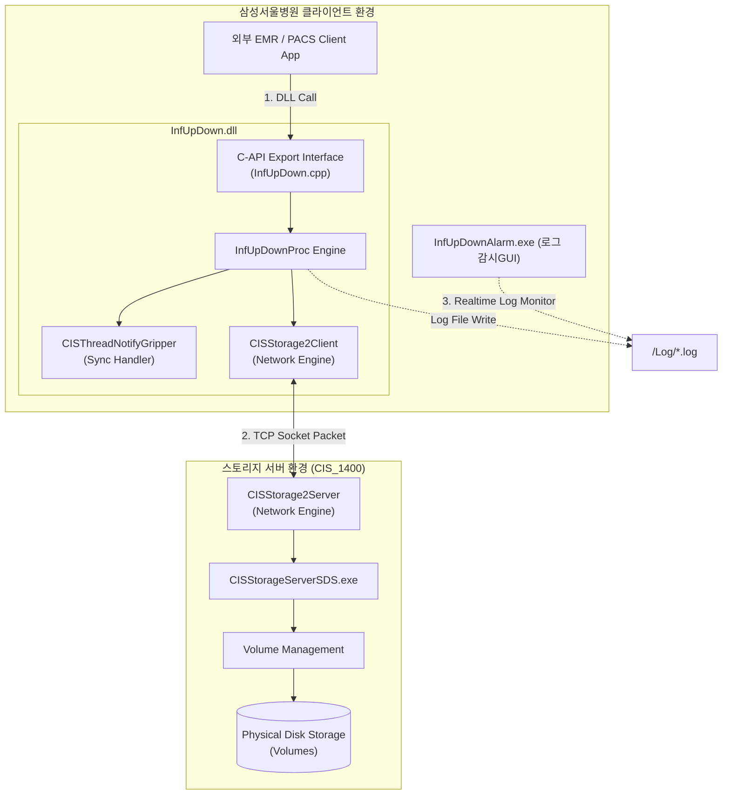
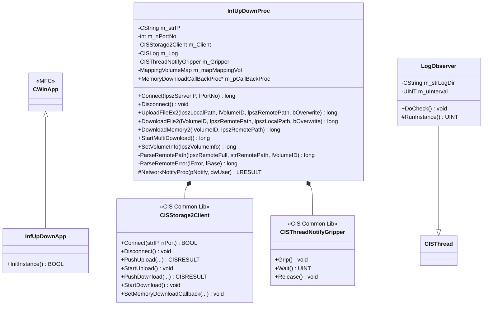
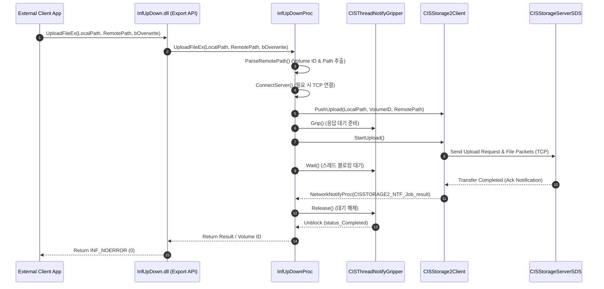
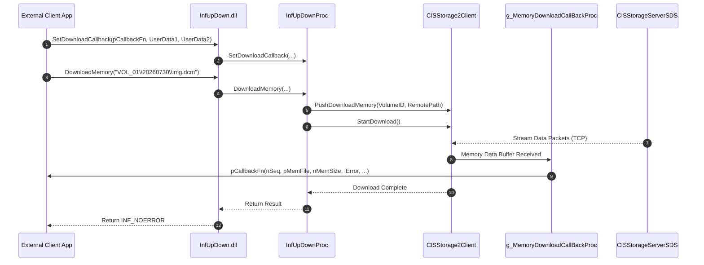

---
{"dg-publish":true,"permalink":"/inf-up-down/","dg-note-properties":{}}
---

[[CIS 2.0/CIS 분석\|CIS 분석]]
# InfUpDown 프로젝트 분석 보고서

## 1. 사용자 요청 내용 (User Request)

> **요청 사항:**
> `D:\Proj\CIS_CUSTOM\삼성서울병원\InfUpDown` 경로 구조 및 프로젝트 코드 분석을 해주세요.
> `CIS_1400/CISStorageServerSDS`와 관련 있는 것으로 압니다.
> 프로그램 UML 관련 다이어그램으로 표현할 수 있는 내용도 추가해주세요.

---

## 2. 프로젝트 개요

`InfUpDown` 프로젝트는 **인피니트헬스케어(INFINITT Co., Ltd.)**에서 **삼성서울병원(SMC)** 맞춤형(Custom)으로 개발된 **PACS 스토리지 서버 연동 파일/메모리 업·다운로드 C-Interface DLL 모듈 및 관련 유틸리티/샘플 모듈**입니다.

삼성서울병원의 의료 정보 시스템(HIS/EMR/PACS) 또는 외곽 클라이언트 프로그램이 인피니트의 스토리지 서버(`CISStorageServerSDS`)와 직접 TCP/IOCP 소켓 통신을 수행하여 **의료 영상 및 일반 파일의 업로드, 다운로드, 메모리 직접 수신, 파일 삭제**를 손쉽게 수행할 수 있도록 C-API 형태의 DLL 인터페이스를 제공합니다.

---

## 3. 디렉토리 경로 구조 분석

`D:\Proj\CIS_CUSTOM\삼성서울병원\InfUpDown` 하위 구조는 다음과 같이 역할별로 명확히 분리되어 있습니다.

```
InfUpDown/
├── BIN/                                  # 빌드 결과물 (.dll, .exe, .lib, .pdb 등 모음)
├── Distribute/                           # 삼성서울병원 배포용 패키지
│   ├── CISStorageServerSDS_Win32/        # 연동 대상 서버 실행 파일 및 라이브러리
│   ├── InfUpDown/                        # 배포용 InfUpDown.dll 및 헤더
│   ├── Sample/                           # 연동 테스트용 샘플 클라이언트
│   ├── ServerTester/                     # 스토리지 서버 테스트 툴
│   ├── InfUpDown_v6.pptx                 # 시스템 연동 사양서 PPT
│   └── InfUpDown_ErrorCode.pptx          # 에러 코드 정의서 PPT
├── Doc/                                  # 버전별 사양서 및 문서 모음 (v1~v6, ErrorCode)
└── Source/                               # 소스 코드 전체
    ├── CIS Common Build Events.vsprops   # Visual Studio 빌드 설정 1
    ├── CIS Common Library.vsprops        # Visual Studio 빌드 설정 2
    ├── InfUpDown/                        # [핵심] InfUpDown.dll C-API 라이브러리 소스
    ├── InfUpDownAlarm/                   # 로그 감시 및 오류 실시간 알람 GUI 모듈
    ├── DecryptPWD/                       # INI 설정 암호화 비밀번호 복호화 유틸리티
    ├── Sample/                           # 기본 C++ MFC 연동 샘플 1
    └── Sample2/                          # 메모리 콜백 및 다중 다운로드 샘플 2
```

### [Source] 주요 서브 프로젝트별 상세 설명

| 서브 프로젝트 | Output | 역할 및 설명 |
| :--- | :--- | :--- |
| [InfUpDown](file:///D:/Proj/CIS_CUSTOM/%EC%82%BC%EC%84%B1%EC%84%9C%EC%9A%B8%EB%B3%91%EC%9B%90/InfUpDown/Source/InfUpDown) | `InfUpDown.dll` | C-Interface 내보내기(Export) 함수들을 제공하는 핵심 DLL 모듈 |
| [InfUpDownAlarm](file:///D:/Proj/CIS_CUSTOM/%EC%82%BC%EC%84%B1%EC%84%9C%EC%9A%B8%EB%B3%91%EC%9B%90/InfUpDown/Source/InfUpDownAlarm) | `InfUpDownAlarm.exe` | 생성된 로그 파일을 모니터링하여 오류 발생 시 트레이/팝업 알람 제공 |
| [DecryptPWD](file:///D:/Proj/CIS_CUSTOM/%EC%82%BC%EC%84%B1%EC%84%9C%EC%9A%B8%EB%B3%91%EC%9B%90/InfUpDown/Source/DecryptPWD) | `DecryptPWD.exe` | INI 파일 내 암호화된 서버 접속 정보/비밀번호 복호화 도구 |
| [Sample](file:///D:/Proj/CIS_CUSTOM/%EC%82%BC%EC%84%B1%EC%84%9C%EC%9A%B8%EB%B3%91%EC%9B%90/InfUpDown/Source/Sample) / [Sample2](file:///D:/Proj/CIS_CUSTOM/%EC%82%BC%EC%84%B1%EC%84%9C%EC%9A%B8%EB%B3%91%EC%9B%90/InfUpDown/Source/Sample2) | `Sample.exe` | 외부 시스템 개발자를 위한 단일/다중/메모리 다운로드 예제 코드 |

---

## 4. `CIS_1400/CISStorageServerSDS`와의 연관성 분석

`InfUpDown`과 [`CISStorageServerSDS`](file:///D:/Proj/CIS_1400/trunk/Source/CISStorageServerSDS)는 **Client-Server 통신 쌍(Pair)** 관계입니다.

```
 [ 삼성서울병원 EMR/클라이언트 ] ──(C-API Call)──> [ InfUpDown.dll ]
                                                      │
                                                      │ (TCP/IOCP - CISStorage2Client)
                                                      ▼
 [ CIS 1400 제품군 ]           ──(Socket Listen)─> [ CISStorageServerSDS ]
                                                      │
                                                      ▼
                                            [ Physical Storage Volume ]
```

1. **프로토콜 연동 (`CISStorage2Client` <-> `CISStorage2Server`)**
   - `InfUpDown` 내부의 [`InfUpDownProc`](file:///D:/Proj/CIS_CUSTOM/%EC%82%BC%EC%84%B1%EC%84%9C%EC%9A%B8%EB%B3%91%EC%9B%90/InfUpDown/Source/InfUpDown/InfUpDownProc.h#L20) 클래스는 인피니트 표준 라이브러리의 `CISStorage2Client` 객체를 소유합니다.
   - [`CISStorageServerSDS`](file:///D:/Proj/CIS_1400/trunk/Source/CISStorageServerSDS/CISStorageServerSDS.h#L28)는 `CISStorage2Server` 엔진을 사용하여 소켓 요청을 대기(Listen)하고, 물리적 스토리지 볼륨에 파일 보관 및 조회를 담당합니다.
2. **배포 패키지 결합**
   - `Distribute/` 폴더에 `CISStorageServerSDS_Win32` 가 포함되어 있는 이유도, 서버 세팅 시 `CISStorageServerSDS`를 구동한 후 클라이언트 측에서 `InfUpDown.dll`로 접속하여 데이터 전송 검증을 수행하기 때문입니다.
3. **볼륨 및 에러 코드 호환**
   - `InfUpDownProc`의 에러 파싱 함수(`ParseRemoteError`)는 `ECIS_STORAGE_VOLUME_NOT_EXIST`(-703), `ECIS_FILE_NOT_EXIST`(-210) 등 `CISStorageServerSDS`가 반환하는 내부 에러 코드를 `InfUpDown` 전용 에러 코드(`INFERR_REMOTE_VOLUME`, `INFERR_REMOTE_NOT_EXIST`)로 매핑합니다.

---

## 5. 모듈별 핵심 코드 분석

### 5.1. `InfUpDown.dll` C-API 내보내기 인터페이스

[`InfUpDown.cpp`](file:///D:/Proj/CIS_CUSTOM/%EC%82%BC%EC%84%B1%EC%84%9C%EC%9A%B8%EB%B3%91%EC%9B%90/InfUpDown/Source/InfUpDown/InfUpDown.cpp#L65)는 C# / VB / Delphi / Java 등 타 언어 및 타 시스템에서 Dynamic Linking할 수 있도록 `extern "C" long PASCAL EXPORT` 형태의 함수를 내보냅니다. 전역 객체 `g_PROC`(`InfUpDownProc`)의 메서드로 라우팅됩니다.

* **연결 관리**: `Connect()`, `Disconnect()`
* **파일 업로드**: `UploadFile()`, `UploadFile2()`, `UploadFileEx()`, `UploadFileEx2()`
* **파일 다운로드**: `DownloadFile()`, `DownloadFile2()`, `ResetDownloadList()`, `PushDownload()`, `StartMultiDownload()`
* **메모리 다운로드 (RAM 수신)**: `SetDownloadCallback()`, `DownloadMemory()`, `DownloadMemory2()`, `PushDownloadMemory()`
* **원격 파일 삭제**: `DeleteRemoteFile()`, `DeleteRemoteFile2()`
* **설정 및 로그**: `SetVolumeInfo()`, `SetLogDirectory()`

### 5.2. `InfUpDownProc` (핵심 비즈니스 로직)

[`InfUpDownProc.h`](file:///D:/Proj/CIS_CUSTOM/%EC%82%BC%EC%84%B1%EC%84%9C%EC%9A%B8%EB%B3%91%EC%9B%90/InfUpDown/Source/InfUpDown/InfUpDownProc.h#L20) / [`InfUpDownProc.cpp`](file:///D:/Proj/CIS_CUSTOM/%EC%82%BC%EC%84%B1%EC%84%9C%EC%9A%B8%EB%B3%91%EC%9B%90/InfUpDown/Source/InfUpDown/InfUpDownProc.cpp#L57)

1. **비동기 이벤트 동기화 (`CISThreadNotifyGripper`)**
   - `CISStorage2Client`는 비동기 소켓 방식으로 동작하지만, DLL을 호출하는 외부 애플리케이션은 동기(Blocking) 형태의 함수 호출을 선호합니다.
   - `InfUpDownProc`는 `CISThreadNotifyGripper`를 등록하여 `UploadFile`, `DownloadFile` 등의 함수 호출 시 `m_Gripper.Grip()` 후 `m_Gripper.Wait()`로 대기하며, 서버 완료 응답 통지(`CISSTORAGE2_NTF_Job_result`)가 오면 블로킹을 해제합니다.
2. **경로 파싱 및 볼륨 ID 변환 (`ParseRemotePath`)**
   - 원격 경로 표현 방식 2가지를 모두 지원합니다.
     - `VolumeID|Path` 형태 (예: `1001|\2026\07\30\file.dcm`)
     - `VolumeNickname\Path` 형태 (예: `VOL_PACS_01\2026\07\30\file.dcm`)
   - `StorageVolumeInfo.xml` 정보를 읽어 `m_mapMappingVol` (CMap)에 닉네임과 Volume ID를 맵핑하고 문자열 경로를 Volume ID로 자동 변환합니다.
3. **메모리 직접 다운로드 Callback 처리**
   - Disk IO 없이 메모리로 직접 수신 시 `g_MemoryDownloadCallBackProc`를 통해 외부 콜백 함수로 버퍼(`char* pMemFile`, `long nMemSize`)와 진행 상태/에러 코드를 전달합니다.

### 5.3. `InfUpDownAlarm` (로그 감시 알람)

[`LogObserver.h`](file:///D:/Proj/CIS_CUSTOM/%EC%82%BC%EC%84%B1%EC%84%9C%EC%9A%B8%EB%B3%91%EC%9B%90/InfUpDown/Source/InfUpDownAlarm/LogObserver.h#L19)
- `CISThread` 기반의 백그라운드 스레드가 `InfUpDown`의 로그 디렉토리를 타이머 주기마다 스캔합니다.
- 오류 로그 발생 시 윈도우 메인 대화상자(`CInfUpDownAlarmDlg`)로 메시지를 전송하여 시스템 관리자에게 실시간 팝업/알림을 띄웁니다.

---

## 6. UML 다이어그램

### 6.1. 시스템 아키텍처 다이어그램 (System Architecture Diagram)



---

### 6.2. 클래스 다이어그램 (Class Diagram)



---

### 6.3. 시퀀스 다이어그램: 파일 업로드 흐름 (File Upload Sequence)



---

### 6.4. 시퀀스 다이어그램: 메모리 다운로드 콜백 흐름 (Memory Download Sequence)



---

## 7. 요약 및 결론

1. **삼성서울병원 커스텀 컴포넌트**: `InfUpDown`은 삼성서울병원의 특수 요구사항(메모리 전달 콜백, 닉네임 기반 볼륨 자동 맵핑, 실시간 로그 감시 알람 등)이 적용된 전용 스토리지 클라이언트 라이브러리입니다.
2. **안정적인 동기화 처리 Engine**: 비동기 네트워크 엔진(`CISStorage2Client`) 상위에 `CISThreadNotifyGripper` 구조를 배치하여 API 사용자의 구현 편의성(동기 방식 호출)과 네트워크 성능(IOCP 기반 비동기)을 동시에 달성했습니다.
3. **`CISStorageServerSDS`와의 완전한 호환**: 인피니트 CIS 1400 스토리지 서버 라인업과 동일한 패킷 프로토콜 및 Volume 매핑 규칙을 사용합니다.
